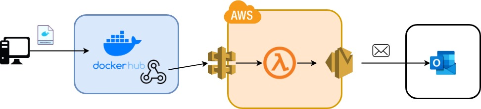

# Docker Task

## Summary
We want to dockerise the terminal application that was developed for the python team project. When the task is complete, 

## Acceptance Criteria
- Application fully working in docker
- Push docker image to DockerHub
- Have webhook ready on DockerHub repository
- Research and implement a way to automatically send emails to recipients after webhook is called.

## Documentation
Pull docker image from docker hub:

```
docker pull conjectures/eng84_airplaneapp:v0.1
```
Run docker image as detached, and link port 8000
```
docker run -d -p 8000:8000 conjectures/eng_airplaneapp:v0.1
```
Find the application on localhost

## Solution
Since the task requires for automated email reporting, it was decided to use AWS services.
Specifically, the AWS API Gateway, Lambda Functions, and SES services are used.



